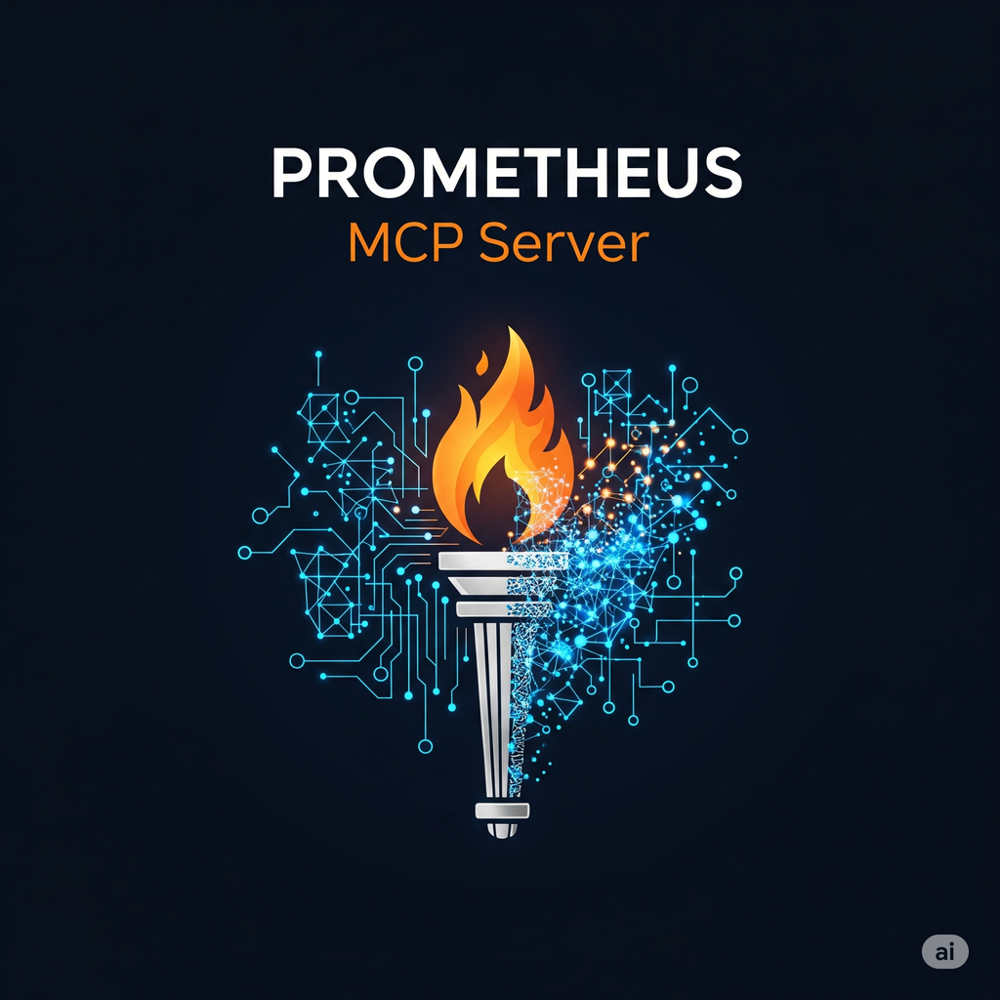

# Prometheus MCP Server

[](https://github.com/tjhop/prometheus-mcp-server/blob/master/LICENSE)
[](https://goreportcard.com/report/github.com/tjhop/prometheus-mcp-server)
[](https://github.com/tjhop/prometheus-mcp-server/actions/workflows/golangci-lint.yaml)
[](https://github.com/tjhop/prometheus-mcp-server/releases/latest)
[](https://github.com/tjhop/prometheus-mcp-server/releases/latest)



## About
This is an [MCP](https://modelcontextprotocol.io/introduction) server to allow LLMs to interact with a running [Prometheus](https://prometheus.io/) instance via the API to do things like generate and execute promql queries, list and analyze metrics, etc.

Here is a screen recording using Google Gemini models to report on the health of the Prometheus instance that powers [prometheus.demo.prometheus.io/](https://prometheus.demo.prometheus.io/query). The prompt used was:

> please provide a comprehensive review and summary of the prometheus server.
> review it's configuration, flags, runtime/build info, and anything else that
> you feel may provide insight into the status of the prometheus instance,
> including analyzing metrics and executing queries

:warning: _NOTE_: I used `yolo` mode in the demo to auto-accept tool usage. You probably shouldn't do this. Please read/understand/approve your tool usage, don't just let the LLM go wild. That's how you end up with robot overlords.

[](https://asciinema.org/a/733513)

### Tools

#### Full Tool List

| Tool Name | Description |
| --- | --- |
| `alertmanagers` | Get overview of Prometheus Alertmanager discovery |
| `build_info` | Get Prometheus build information |
| `config` | Get Prometheus configuration |
| `docs_list` | List of Official Prometheus Documentation Files |
| `docs_read` | Read the named markdown file containing official Prometheus documentation from the prometheus/docs repo |
| `exemplars_query` | Performs a query for exemplars by the given query and time range |
| `flags` | Get runtime flags |
| `label_names` | Returns the unique label names present in the block in sorted order by given time range and matchers |
| `label_values` | Performs a query for the values of the given label, time range and matchers |
| `list_alerts` | List all active alerts |
| `list_rules` | List all alerting and recording rules that are loaded |
| `list_targets` | Get overview of Prometheus target discovery |
| `metric_metadata` | Returns metadata about metrics currently scraped by the metric name | 
| `query` | Execute an instant query against the Prometheus datasource |
| `range_query` | Execute a range query against the Prometheus datasource |
| `runtime_info` | Get Prometheus runtime information |
| `series` | Finds series by label matchers |
| `targets_metadata` | Returns metadata about metrics currently scraped by the target |
| `tsdb_stats` | Get usage and cardinality statistics from the TSDB |
| `wal_replay_status` | Get current WAL replay status |

__NOTE:__ 
> Because the [TSDB Admin API endpoints](https://prometheus.io/docs/prometheus/latest/querying/api/#tsdb-admin-apis)
> allow for potentially destructive operations like deleting data, they are not
> enabled by default. In order to enable the TSDB Admin API endpoints, the MCP
> server must be started with the flag `--dangerous.enable-tsdb-admin-tools` to
> acknowledge the associated risk these endpoints carry.

| Tool Name | Description |
| --- | --- |
| `clean_tombstones` | Removes the deleted data from disk and cleans up the existing tombstones |
| `delete_series` | deletes data for a selection of series in a time range |
| `snapshot` | creates a snapshot of all current data into snapshots/<datetime>-<rand> under the TSDB's data directory and returns the directory as response |

#### Tool Sets

The server exposes many tools to interact with Prometheus. There are tools to interact with Prometheus via the API, as well as additional tools to do things like read documentation, etc.
By default, they are all registered and available for use (TSDB Admin API tools need an extra flag).

To be considerate to LLMs with smaller context windows, it's possible to pass in a whitelist of specific tools to register with the server.
The following 'core' tools are always loaded: `[docs_list, docs_read, query, range_query, metric_metadata, label_names, label_values, series]`.
Additional tools can be specified with the [`--mcp.tools` flag](#command-line-flags).

For example, the command line:

```shell
prometheus-mcp-server --mcp.tools=build_info --mcp.tools=flags --mcp.tools=runtime_info
```

Would result in the following tools being loaded:

- `build_info`
- `docs_list`
- `docs_read`
- `flags`
- `label_names`
- `label_values`
- `metric_metadata`
- `query`
- `range_query`
- `runtime_info`
- `series`

### Resources

| Resource Name | Resource URI | Description | 
| --- | --- | --- |
| `prometheus://list_metrics` | List metrics available |
| `prometheus://targets` | Overview of the current state of the Prometheus target discovery |
| `prometheus://tsdb_stats` | Usage and cardinality statistics from the TSDB |
| `prometheus://docs` | List of official Prometheus Documentation files |
| `prometheus://docs{/file*}` | Read official Prometheus Documentation files by name | 

### Prompts

_Not implemented yet, to be determined_

## Installation and Usage

This MCP server is most useful when fully integrated with tooling and/or installed as a tool server with another system.
Installation procedures and integration support will vary depending on the tools being used.
For example: 
- some systems can only interact with MCP tools and not resources/prompts 
- some systems use mcp.json config file format to manage MCP servers and some require custom formats
- some systems don't speak MCP directly and require tools like mcp-to-openapi to proxy 

Please check the documentation for the tool being used/integrated for specific instructions and level of support.

### Binary
Download a release appropriate for your system from the [Releases](https://github.com/tjhop/prometheus-mcp-server/releases) page.

```shell
/path/to/prometheus-mcp-server <flags>
```

### Docker

```shell
# Stdio transport
docker run --rm -i ghcr.io/tjhop/prometheus-mcp-server:latest --prometheus.url "https://$yourPrometheus:9090" 
```

```shell
# Streamable HTTP transport (capable of SSE as well)
docker run --rm -p 8080:8080 ghcr.io/tjhop/prometheus-mcp-server:latest --prometheus.url "https://$yourPrometheus:9090" --mcp.transport "http" --web.listen-address ":8080"
```

### System Packages
Download a release appropriate for your system from the [Releases](https://github.com/tjhop/prometheus-mcp-server/releases) page. A Systemd service file is included in the system packages that are built.

```shell
# install system package (example assuming Debian based)
apt install /path/to/package
# create unit override, add any needed flags
systemctl edit prometheus-mcp-server.service
systemctl enable --now prometheus-mcp-server.service
```

_Note_: While packages are built for several systems, there are currently no plans to attempt to submit packages to upstream package repositories.

## Development
### Development Environment with Devbox + Direnv
If you use [Devbox](https://www.jetify.com/devbox) and
[Direnv](https://direnv.net/), then simply entering the directory for the repo
should set up the needed software.

### Local LLM with Ollama
See [`mcp.json`](./examples/mcp.json) for an example MCP config for use with tooling.
Requires [`ollama`](https://github.com/ollama/ollama) to be installed.

_NOTE:_ 
> To override the default LLM (`ollama:gpt-oss:20b`), run `export
> OLLAMA_MODEL="ollama:your_model"` to override it before running `make` .

<details>
<summary>Using MCP Inspector and a local ollama instance:</summary>

Requires [MCP Inpsector](https://github.com/modelcontextprotocol/inspector) to be installed:

```bash
make inspector
```
</details>

<details>
<summary>Using mcphost and a local ollama instance:</summary>

Requires [`mcphost`](https://github.com/mark3labs/mcphost) to be installed:

```bash
make mcphost
```
</details>

### Gemini with gemini-cli
See [`settings.json`](./examples/.gemini/settings.json) for an example config file to run gemini-cli with the prometheus-mcp-server.
Requires [gemini-cli](https://github.com/google-gemini/gemini-cli) to be installed. 

<details>
<summary>Using `gemini-cli` and hosted models:</summary>

```bash
make gemini
```
</details>

### Manual Setup
Required software:
- Working Go environment
- Docker for local tests/linting/image building/etc
- GNU Make
- [ollama](https://github.com/ollama/ollama)
- [mcp inspector](https://github.com/modelcontextprotocol/inspector)
- [mcphost](https://github.com/mark3labs/mcphost)

### Building

The included Makefile has several targets to aid in development:

```bash
~/go/src/github.com/tjhop/prometheus-mcp-server (main [ ]) -> make

Usage:
  make <target>

Targets:
  help                           print this help message
  submodules                     ensure git submodules are initialized and updated
  tidy                           tidy modules
  fmt                            apply go code style formatter
  lint                           run linters
  binary                         build a binary
  build                          alias for `binary`
  build-all                      test release process with goreleaser, does not publish/upload
  container                      build container images with goreleaser, alias for `build-all`
  image                          build container images with goreleaser, alias for `build-all`
  test                           run tests
  mcphost                        use mcphost to run the prometheus-mcp-server against a local ollama model
  inspector                      use inspector to run the prometheus-mcp-server in STDIO transport mode
  inspector-http                 use inspector to run the prometheus-mcp-server in streamable HTTP transport mode
  open-webui                     use open-webui to run the prometheus-mcp-server
  gemini                         use gemini-cli to run the prometheus-mcp-server against Google Gemini models
```
## Command Line Flags

The available command line flags are documented in the help flag:

```bash
~/go/src/github.com/tjhop/prometheus-mcp-server (main [ ]) -> ./prometheus-mcp-server --help
usage: prometheus-mcp-server [<flags>]


Flags:
  -h, --[no-]help                Show context-sensitive help (also try --help-long and --help-man).
      --mcp.tools=all ...        List of mcp tools to load. The target `all` can be used to load all tools. The target `core` loads only the core tools: [`docs_list`,
                                 `docs_read`, `query`, `range_query`, `metric_metadata`, `label_names`, `label_values`, `series`] Otherwise, it is treated as an allow-list
                                 of tools to load, in addition to the core tools. Please see project README for more information and the full list of tools.
      --prometheus.url="http://127.0.0.1:9090"  
                                 URL of the Prometheus instance to connect to
      --http.config=HTTP.CONFIG  Path to config file to set Prometheus HTTP client options
      --web.telemetry-path="/metrics"  
                                 Path under which to expose metrics.
      --web.max-requests=40      Maximum number of parallel scrape requests. Use 0 to disable.
      --[no-]dangerous.enable-tsdb-admin-tools  
                                 Enable and allow using tools that access Prometheus' TSDB Admin API endpoints (`snapshot`, `delete_series`, and `clean_tombstones` tools).
                                 This is dangerous, and allows for destructive operations like deleting data. It is not the fault of this MCP server if the LLM you're
                                 connected to nukes all your data. Docs: https://prometheus.io/docs/prometheus/latest/querying/api/#tsdb-admin-apis
      --log.file=LOG.FILE        The name of the file to log to (file rotation policies should be configured with external tools like logrotate)
      --mcp.transport="stdio"    The type of transport to use for the MCP server [`stdio`, `http`].
      --[no-]web.systemd-socket  Use systemd socket activation listeners instead of port listeners (Linux only).
      --web.listen-address=:8080 ...  
                                 Addresses on which to expose metrics and web interface. Repeatable for multiple addresses. Examples: `:9100` or `[::1]:9100` for http,
                                 `vsock://:9100` for vsock
      --web.config.file=""       Path to configuration file that can enable TLS or authentication. See:
                                 https://github.com/prometheus/exporter-toolkit/blob/master/docs/web-configuration.md
      --log.level=info           Only log messages with the given severity or above. One of: [debug, info, warn, error]
      --log.format=logfmt        Output format of log messages. One of: [logfmt, json]
      --[no-]version             Show application version.

```

